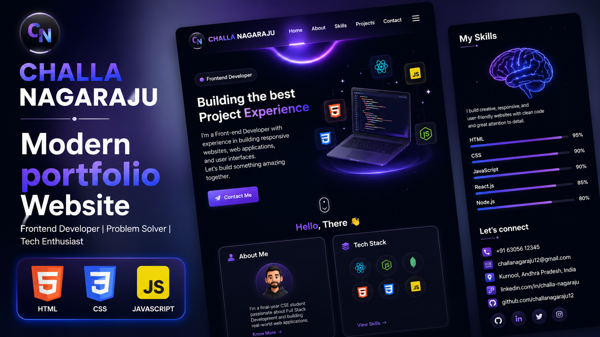

# 👋 Challa Nagaraju Portfolio

<p align="center">
  <a href="https://YOUR-LIVE-WEBSITE.vercel.app" target="_blank">
    
  </a>
</p>

---

# 🚀 About This Project

This is my personal portfolio website, designed and developed to showcase my skills, projects, certifications, and achievements as a Full Stack Developer.

The website features a modern UI with smooth animations, responsive layouts, interactive sections, and a professional design to provide an engaging user experience.

---

## ✨ Features

- 🏠 Modern Hero Section
- 👨‍💻 About Me
- 💡 Skills Showcase
- 📂 Projects Section
- 📞 Contact Form
- 📱 Fully Responsive Design
- 🌌 Animated Background
- ✨ Smooth Scrolling
- 🎨 Modern UI/UX

---

## 🛠️ Technologies Used

- HTML5
- CSS3
- JavaScript
- Boxicons
- AOS (Animate On Scroll)

---

## 📸 Preview

<p align="center">
  
</p>

---

## 🌐 Live Demo

👉 **Portfolio Website**

https://YOUR-LIVE-LINK.vercel.app

---

## 📁 Project Structure

```text
Portfolio/
│
├── images/
├── videos/
├── index.html
├── style.css
├── app.js
├── thumbnail.png
└── README.md
```

---

## 📬 Contact Me

📧 **Email:** challanagarajudcme012@gmail.com

💼 **LinkedIn:**  
https://www.linkedin.com/in/naga-raju-24282827a

💻 **GitHub:**  
https://github.com/rajunaga12

---

## 👨‍💻 About Me

I'm **Challa Nagaraju**, a final-year Computer Science Engineering student passionate about Full Stack Development.

I enjoy building responsive, scalable, and user-friendly web applications using modern web technologies such as HTML, CSS, JavaScript, React.js, Node.js, Express.js, MongoDB, Java, and AWS.

I'm actively seeking opportunities as a:

- Software Engineer
- Full Stack Developer
- Java Developer
- Cloud Engineer

---

## ⭐ Support

If you like this project, don't forget to ⭐ star the repository on GitHub!

---

© 2026 Challa Nagaraju. All Rights Reserved.
